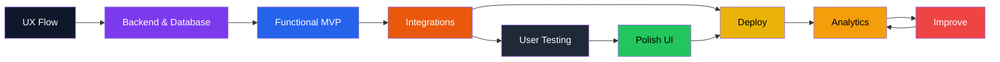

# Monika
### Full-Stack Developer • AI Integrations • Automation • Data

Designing systems, not just features.  
Connecting APIs • Automation • Intelligence • Insight

 

 

---

## 🧠 About Me

I learn by building and debugging real projects instead of only studying theory.

My focus is connecting systems:

**Backend → APIs → AI → Automation → Users → Insights**

- 🌱 Learning Full-Stack Development & Machine Learning  
- 🤖 Building AI tools, agents & MCP workflows  
- 📊 Creating dashboards using Power BI  
- 🧪 Break → Debug → Understand → Improve  
- 🎯 Goal: Become a strong problem-solving developer  

---
## 🧭 How I Build Systems

---
## 🧰 Tech Stack

| 🎨 Frontend | 🧠 Languages | 🗄️ Database | 🎯 Design |
|:-----------:|:-----------:|:-----------:|:---------:|
|  |  |  |   |

---

| 🤖 AI & Automation | 📊 Analytics | 🚀 Tools |
|:------------------:|:-----------:|:------:|
|   |   |  |

---

## 🛠 Growth & Work

| What I Build | Currently Improving |
|------------|------------------|
| - AI powered web apps - Automation workflows - Chrome extensions - Character & image generation tools - Data dashboards - AI agents connected via MCP | - Clean architecture - System thinking - Debugging complex systems - Machine Learning fundamentals - Reliable AI integrations - Scalable backend design |

---

## 🧪 My Developer Philosophy & 🌟 Mindset

I consider a project done when:

• It works reliably in real usage  
• I fully understand and can modify it confidently  
• It’s stable to use, maintainable, and flexible to extend

> Progress through creating • Discipline > inspiration

---
